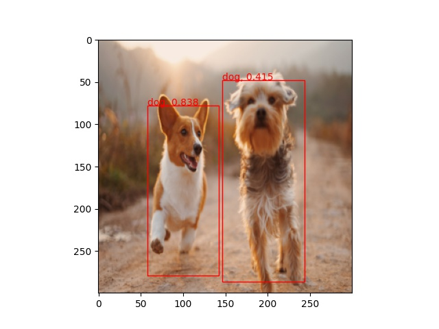
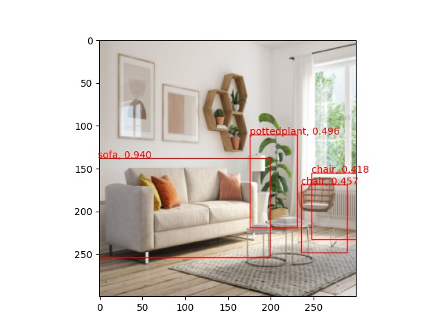

# About

My implementation of an Object Detection Network in PyTorch that uses [focal loss](https://arxiv.org/pdf/1708.02002.pdf). Achieves around 55% MAP on pascalvoc datasets and 25% MAP on COCO dataset. This is fairly low, but to be expected due to the small size of the network. As such, the network is lightweight enough to inference on a laptop cpu at reasonable speed. Uses a ResNet-18 backbone that feeds into a small feature pyramid network to produce feature maps of different sizes, which are then used to predict boxes of different sizes.

This repository also includes a pretrained model for the 20 class pascalvoc dataset which can be used to test your own images (see usage section).

# Installation

This project is written in python 3.7. Once the appropriate dependencies are installed (see requirements.txt), the code is ready to run.

# Usage

Images can be placed in the sample_images folder. Then, one can simply run `python deploy.py`. The resulting detections are saved in the sample_detections folder.

Below are some examples of the network inferencing on test images. Like many SSD networks, the network struggles with smaller objects. This could perhaps be mitigated with better data augmentation. However, these results are certainly a solid baseline.

There is also code provided to train a new network using the pascalvoc or coco dataset, which must be downloaded separately.

